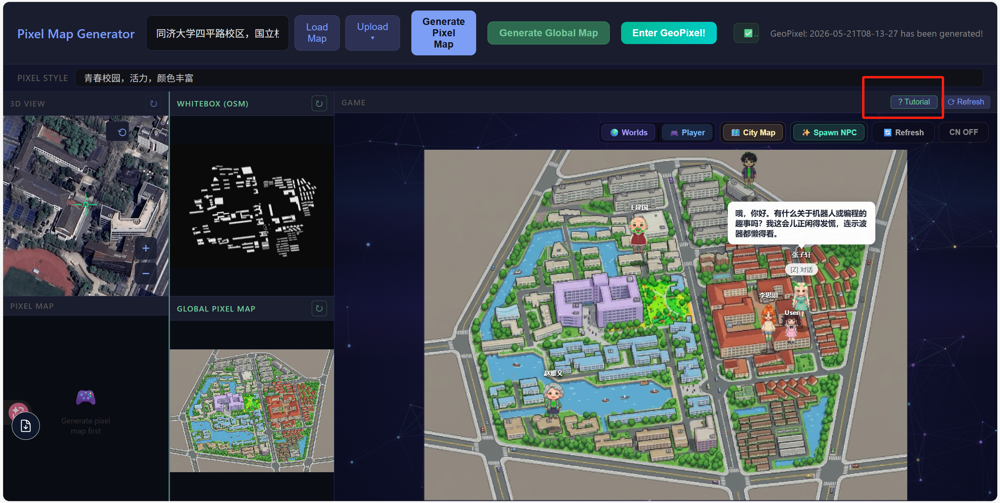

<p align="center">
  <h1 align="center">OpenPixel-RPG</h1>
  <p align="center"><strong>AI-powered pixel-art open-world JRPG — turn any place on Earth into a playable pixel world.</strong></p>
</p>

<p align="center">
  <a href="./GeoPixel/LICENSE"></a>
  
  
  
  
</p>

---

## Overview

Turn any place on Earth into an interactive pixel-art JRPG.

**OpenPixel-RPG** is an AI-powered pixel-art open-world UGC game. Input any location name, or upload your own photo, describe the art style you want, and OpenPixel-RPG generates a complete interactive pixel map with local NPCs. Every character has their own memory, personality, and social relationships — they make decisions, talk to each other, and produce emergent narratives no one scripted. You can also play "god" at any time: inject events, edit character memories or traits, and watch the world shift in response.

Born from [isometric.nyc](https://isometric.nyc), this project replaces the NYC-specific data pipeline with globally available OSM + satellite + 3D Tiles, and deeply integrates [WorldX](https://github.com/YGYOOO/WorldX)'s AI world engine.



> Game tutorial here

---

## Three Modes

### Mode 1 — Upload & Play

Upload your own photo, and OpenPixel-RPG turns it into a pixel-art JRPG world.


> [Watch full video](https://xueqinggao.github.io/video/mode1_demo.mp4)

**How it works:**
1. Select a local image from your device.
2. The 3D View shows your image — set a **Pixel Style** prompt, then click **Generate Pixel Map**.
3. Once the pixel map loads, click **Generate GeoPixel Game** and wait.
4. Click **Enter World** (or the browser loads it automatically) to start playing.

### Mode 2 — NYC Landmark Exploration

Enter a Manhattan landmark name, and OpenPixel-RPG fetches pre-generated pixel tiles from [isometric.nyc](https://isometric.nyc) to build an interactive map.


> [Watch full video](video/Demo2.mp4)

**How it works:**
1. Click **City Map**, then input a location (e.g. Times Square, Central Park, Empire State Building, Brooklyn Bridge, and many more).
2. Wait for the tile to load.
3. Select **Fast Mode** (bottom-right), then click **Generate GeoPixel Game**.
4. Once loaded, click **Enter World**.

### Mode 3 — Anywhere on Earth

Input any address on Earth, and OpenPixel-RPG generates an interactive pixel map using OSM whitebox + satellite imagery + AI style transfer.


> [Watch full video](video/mode3_demo.mp4)

**How it works:**
1. Input an address and click **Load Map**.
2. The 3D View loads a satellite image. Drag to fine-tune the area. Set a **Pixel Style** prompt.
3. Click **Generate Global Map** and wait (~2 minutes) for the OSM whitebox + satellite + AI pipeline to complete.
4. Click **Generate WorldX Game** to build the playable world.
5. Click **Enter World** (or it loads automatically) to start playing.

| Mode | Description | Status |
|------|-------------|--------|
| **Mode 1** — Upload & Play | Upload a photo → AI generates pixel map → playable JRPG world. | Done |
| **Mode 2** — NYC Exploration | Input an NYC landmark → fetch isometric.nyc pixel tile → GeoPixel pipeline. | Done |
| **Mode 3** — Anywhere on Earth | Input any global address → OSM whitebox + satellite + Google 3D Tiles → AI pixel map → playable world. | Done |

---

## Getting Started (port 5173)

```bash
# 1. Enter the G_gen_pixel directory
cd G_gen_pixel

# 2. Install frontend dependencies
npm install

# 3. Install Python dependencies
pip install -r requirements.txt

# 4. Configure API keys
cp .env.example .env
# Edit .env with your Google Maps and DashScope API keys

# 5. Start all services
# Terminal 1: Vite frontend (port 5173)
npm run dev

# Terminal 2: Main backend (port 5001)
python server.py

# Terminal 3: Global map backend (port 5002, for Mode 3)
python global_server.py
```

Open `http://localhost:5173` in your browser, choose a mode, and go.

---

## NPC Generation

Once in the game world, click **Spawn NPC**, input the NPC's location, and wait ~30 seconds. NPCs with local knowledge and personalities will appear on the map. Walk up and press **Z** to interact. Click **Spawn NPC** again to edit or delete existing NPCs.

---

## Acknowledgments

This project stands on the shoulders of two incredible open-source projects:

- **[isometric-nyc](https://github.com/cannoneyed/isometric-nyc)** ([isometric.nyc](https://isometric.nyc)) — The first open-source project to combine AI generation with isometric pixel city maps at scale. It proved "vibe-engineering" could work, and its NYC tile pipeline is the foundation of Mode 2.
- **[WorldX](https://github.com/YGYOOO/WorldX)** — The AI world engine that powers character generation, dialogue, memory, and emergent narrative. One sentence in, a living world out.

OpenPixel-RPG extends isometric-nyc's NYC pipeline to global coverage and integrates GeoPixel's character simulation for a complete AI JRPG experience.

---

## Project Structure

```
OpenPixel-RPG/
├── G_gen_pixel/            # Mode 3 frontend + backends (5173 / 5001 / 5002)
│   ├── server.py              # Main API: geocode, satellite, pixel generation, WorldX jobs
│   ├── global_server.py       # Mode 3 API: OSM whitebox + three-image pipeline
│   ├── whitebox/              # OSM Overpass global whitebox generation
│   ├── src/                   # Vite frontend (main.js, three-column UI)
│   ├── index.html             # Three-column layout (View+Pixel / Global / Game)
│   ├── hyperparams.json       # Unified config (grid cells, canvas size, etc.)
│   └── cache/                 # Satellite image disk cache
├── GeoPixel/                # AI world engine (Mode 2 NYC + NPC + character simulation)
│   ├── client/                # React + Phaser game client
│   ├── server/                # Node.js backend API (Express + WebSocket + SQLite)
│   ├── orchestrator/          # LLM world orchestration engine
│   └── generators/            # Map & character image generation pipeline
├── WorldX-main/             # WorldX game engine (map pipeline, game runtime)
│   ├── generators/map/        # index-from-image.mjs (Steps 2–6: compress → TMJ output)
│   └── client/                # WorldX React + Phaser frontend
├── Map_gen_RPG/             # Satellite → pixel map pipeline scripts (legacy/experimental)
├── Blog/                    # Documentation & tutorials (Chinese)
├── Paper/                   # Academic paper draft
├── ref/                     # Reference projects (isometric-nyc, etc.)
└── video/                   # Demo videos & GIFs
```

---

## License

MIT © OpenPixel-RPG contributors
